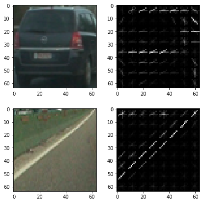
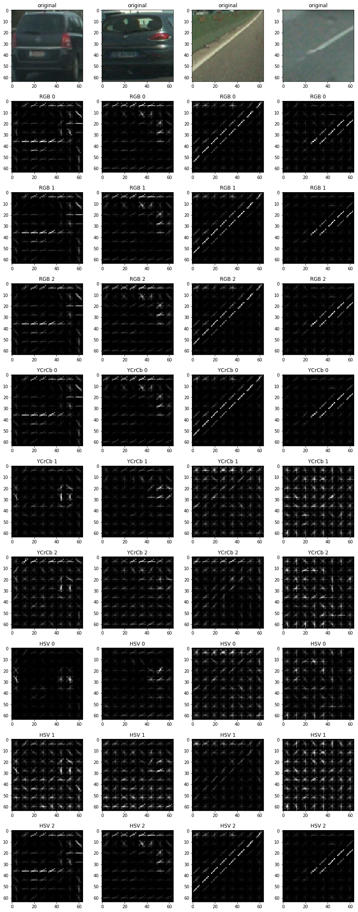
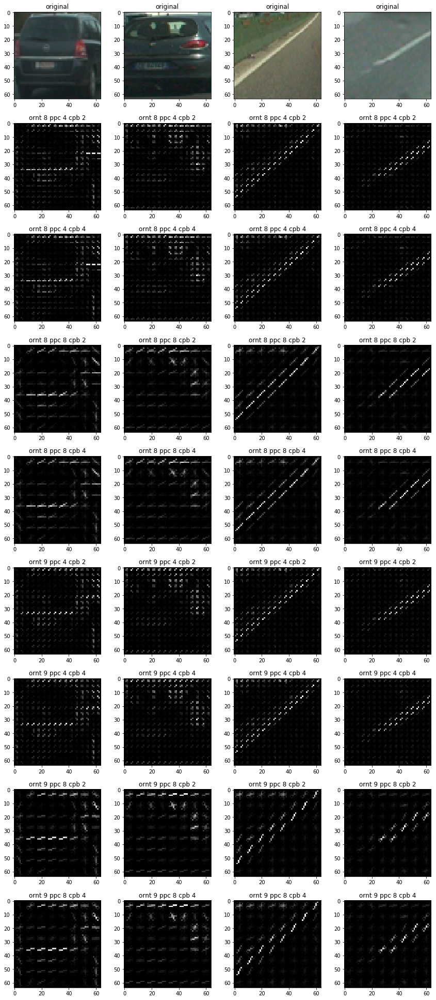
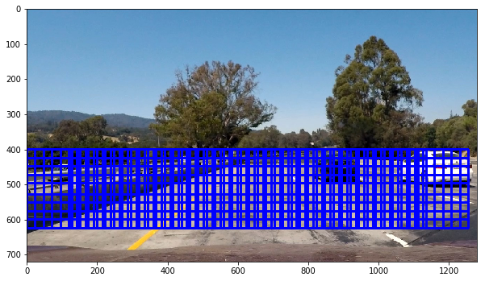
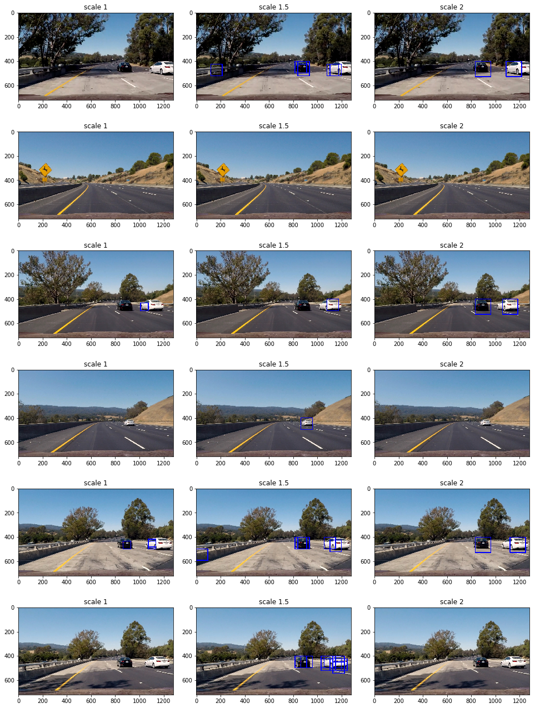
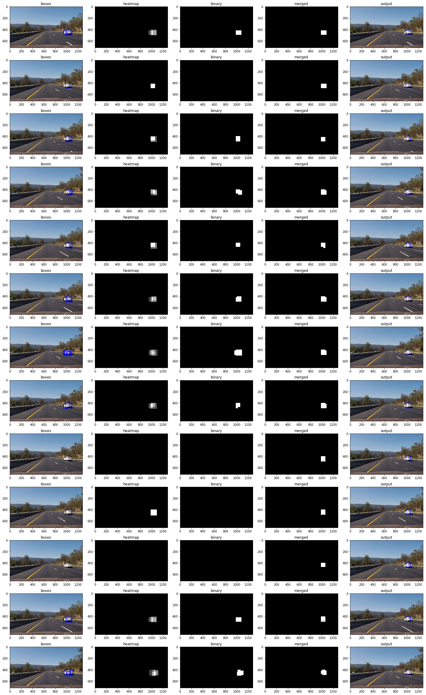
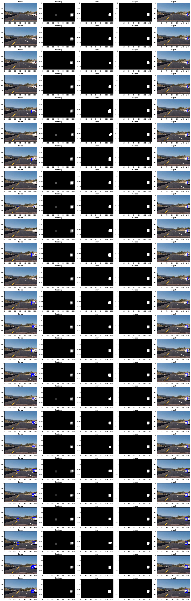

# Vehicle Detection

## Project goals

The goals / steps of this project are the following:

* Extract a Histogram of Oriented Gradients (HOG) features on a labeled training set of images.
* Train a classifier to distinguish between vehicle and non-vehicle images.
* Implement a sliding-window technique and use the trained classifier to search for vehicles in images.
* Run your pipeline on a video stream and create a heat map of recurring detections frame by frame to reject outliers and follow detected vehicles.
* Estimate a bounding box for vehicles detected.

## Project structure

The project is implemented in Jupyter notebook `vehicle_detection.ipynb` included in the repository. Project steps are marked with appropriate subtitles and intermediate steps for all test images are visualized inside the notebook.

## Histogram of Oriented Gradients (HOG)

## Testing HOG features

Extraction of HOG features is implemented using `hog()` function from `skimage` package in the "HOG features" section of the notebook. Here is a visualization of HOG features for a couple of images from the training set.

## Choosing color space and color channels

HOG features with different color spaces and channels were visualized in the "Visualizing color spaces and channels with HOG features" section of the notebook. The goal was to see which channels contain most information to distinguish vehicle and non-vehicle images.

Observations:

* RGB and HSV show most distinction between vehicle and non-vehicle images
* RGB channels seem to be redundant
* HSV channels show distinct features

The decision was to use all channels from HSV color space.

## Choosing HOG parameters

For HOG feature extractor, I experiment with the following parameters:

* orientations: 8 or 9
* number of pixels per cell: 4 or 8
* number of cells per block: 2 or 4

In general, increasing the number of orientations and decreasing the number of pixels per cell leads to capturing more details but less generalizable features, which might require more training data.

Visualizaiton of different parameter values:

Observations:

* 8 orientations seems to be enough to capture contours of a vehicle
* 8 pixels per cell provides enough detail
* not much difference for different values of cells per block

The decision was to use 8 orientations, 8 pixels per cell and 2 cells per block, which we set as default values for `get_hog_features()`.

## Training a classifier

Feature extraction is implemented in the "Training a classifier" section of the notebook. I used HOG features from all channels of HSV color space with parameters as described in the previous section. In addition, I added HSV histogram features with 32 bins for all channels. As a result, my feature set contains 4800 features, where 4704 are HOG features and 96 are histogram features.

Features were extracted from vehicle and non-vehicle train images, 17760 images in total. The dataset is balanced, with equal number of images in both categories. The appropriate labels were generated: 1 - vehicle, 0 - non-vehicle. Features were normalized using the `StandardScaler` from `sklearn`.

I used linear SVM classifier with default parameters. The datase was split into training and testing sets, where testing set contains 20% of images. Data is shuffled by default when using `train_test_split()`. The classifier test accuracy is 98.8%.

## Sliding Window Search

I implemented the optimized version of sliding window search that extracts HOG features only once and then takes a subsample window to classify. The implementation is in the `find_cars()` function under "Sliding window search" section of the notebook. The image is cropped vertically and then HOG features are extracted the same way as for the training images. Here is the visualization of sliding windows with the following parameters:
scale=2, px_per_cell=4, cell_per_block=2, cell_per_step=3.

The output is a list of bounding boxes for identified cars. Here is the visualizaiton for the test images:

As can be seen from images above, I experimented with different scales. At the end I choose to use a combination of scales 1.3 and 1.7.

Although linear SVM classifier performs well it is sensitive to scale. One way to improve it is through data augumentation, e.g. add cropped and scaled vehicle images to training set. Another way to improve the classifier is to add other types of features. I experimented with spatial color features without much success. Although the test accuracy increased to 99.3%, when applied to test image there were a lot of false positives. It might indicate overfitting or a bug in my implementation. With HOG and histogram features few false positives show up on test images. Video pipeline described further in this report attempts to eleminate false positives by looking at multiple consequent frames.

## Video Implementation

### Pipeline steps and parameters

The pipeline is implemented in the "Video pipeline" section of the notebook. The pipeline conatins the following steps:

1. Find bounding boxes from the current frame
1. Create a heatmap from these boxes
1. Use heat threshold to create a binary image
1. Store binary image in the buffer, together with binary images from previous frames
1. Merge binary images from last N frames
1. Apply threshold to a merged image to create another binary image, this time using buffer threshold
1. Use `label` to label features in the thresholded merged image
1. Draw bounding boxes around labeled features

This pipeline contains includes three new parameters:

* heat threshold = 2: number of overlapping bounding boxes from one frame to activate the pixel in the binary image
* buffer threshold = 0.5: number of overlapping activated pixels from binary images in the buffer to activate the pixel in the mereged image, defined as the proportion of images in the buffer
* buffer size = 5: number of binary images from previous frames

### Visualization of the pipeline

The pipeline was developed to deal with false negatives and false positives. Here is an example of how it handles false negatives, when the classifier fails to detect a vehicle in some frames. This visualization shows how the pipeline fills missed detection from previous frames dureing the merge step.

Next visualization shows how this pipeline deals with false positives, when a vehicle is detected where there ar eno vehicles. False positive detections are eliminated when appling the heat threshold, generating binarry images.

### Video processing

The pipeline was reimplemented in the `VehicleDetector` class which the the supporting funcitons to process videos.
Here is [the output for the test video](./output_videos/test_video.mp4) and here is [the output for the project video](./output_videos/project_video.mp4)

## Discussion

I was not able to eliminate all false positives in the project video. Future work would be to improve the classifier:

* Add more training data
* Data augmentation, crop and scale images from existing training data to make the classifier more invarient to scale
* Use a convolutional neural network, which are known to perform very well in image classification tasks

Annother issue is that the current pipeline can't distinguish between cars when they overlap, e.g. 36s in the project video. Finally the pipeline is rather slow, processing of every frame takes 1.5 seconds on Intel Core i7-3770 CPU. My experiments revealed that the main factor is the number of sliding windows, thus lower scaling takes much more time. Vectorising the sliding window algorithm and using GPU would speed up the computations.