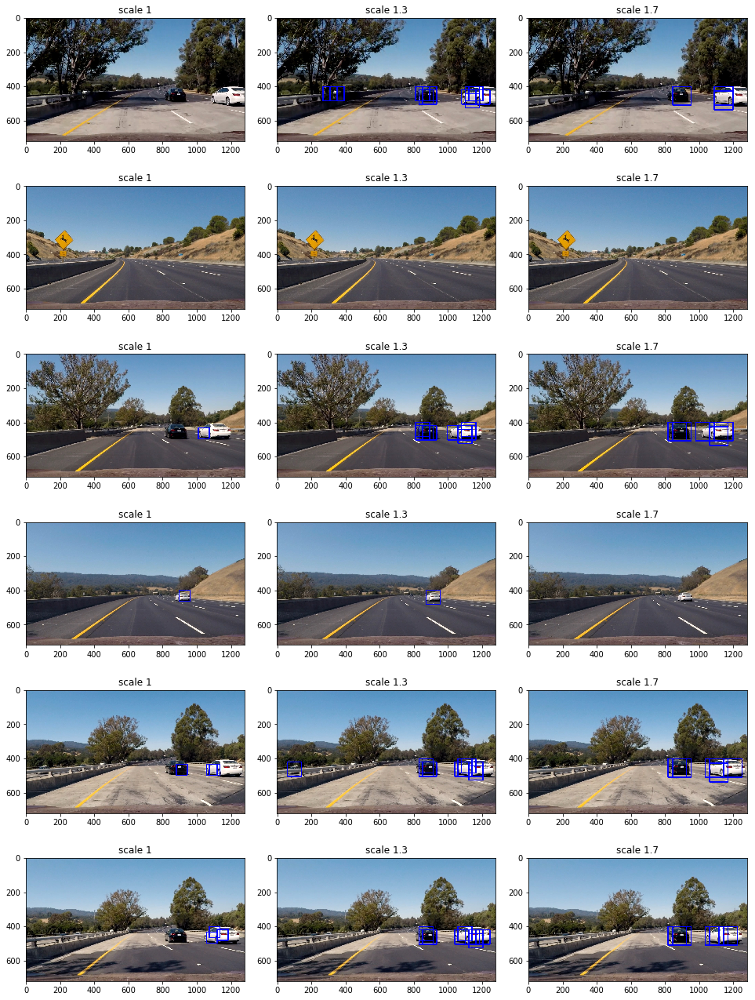

# Vehicle Detection

## Project goals

The goals / steps of this project are the following:

* Extract a Histogram of Oriented Gradients (HOG) features on a labeled training set of images.
* Train a classifier to distinguish between vehicle and non-vehicle images.
* Implement a sliding-window technique and use the trained classifier to search for vehicles in images.
* Run your pipeline on a video stream and create a heat map of recurring detections frame by frame to reject outliers and follow detected vehicles.
* Estimate a bounding box for vehicles detected.

## Project structure

The project is implemented in Jupyter notebook `vehicle_detection.ipynb` included in the repository. Project steps are marked with appropriate subtitles and intermediate steps for all test images are visualized inside the notebook.

## Histogram of Oriented Gradients (HOG)

## Testing HOG features

Extraction of HOG features is implemented using `hog()` function from `skimage` package in the "HOG features" section of the notebook. Here is a visualization of HOG features for a couple of images from the training set.

## Choosing color space and color channels

HOG features with different color spaces and channels were visualized in the "Visualizing color spaces and channels with HOG features" section of the notebook. The goal was to see which channels contain most information to distinguish vehicle and non-vehicle images.

Observations:

* RGB and HSV show most distinction between vehicle and non-vehicle images
* RGB channels seem to be redundant
* HSV channels show distinct features

The decision was to use all channels from HSV color space.

## Choosing HOG parameters

For HOG feature extractor, I experiment with the following parameters:

* orientations: 8 or 9
* number of pixels per cell: 4 or 8
* number of cells per block: 2 or 4

In general, increasing the number of orientations and decreasing the number of pixels per cell leads to capturing more details but less generalizable features, which might require more training data.

Visualizaiton of different parameter values:

Observations:

* 8 orientations seems to be enough to capture contours of a vehicle
* 8 pixels per cell provides enough detail
* not much difference for different values of cells per block

The decision was to use 8 orientations, 8 pixels per cell and 2 cells per block, which we set as default values for `get_hog_features()`.

## Training a classifier

HOG features from all channels of HSV color space were used as features for the classifier, implemented in the `get_hsv_hog_features` function under "Training a classifier" section of the notebook.

Features were extracted from vehicle and non-vehicle train images, 17760 images in total. The dataset is balances, with ca. equal number of images in both categories. The appropriate labels were generated: 1 - vehicle, 0 - non-vehicle. Features were normalized using the `StandardScaler` from `sklearn`.

I used linear SVM classifier with default parameters. For training and testing the datase was split into train and test set, where test set contains 20% of data. Data is shuffled by default when using the `train_test_split()` function. The classifier achived test accuracy of 97.8%.

## Sliding Window Search

I implemented the optimized version of sliding window search that extracts HOG features only once and then takes a subsample window to classify. The implementation is in the `find_cars()` function under "Sliding window search" section of the notebook. The image is cropped vertically and then HOG features are extracted the same way as for the training images. The output is a list of bounding boxes for identified cars. Here is the visualizaiton for the test images:

As can be ssen from images above, I experimented with different scales, concluding that a combination of scales 1.5 and 2 work reasonable well.

SVM classifier seems to work reasonable well with reasonably high test accuracy and good performance on the test images. It also seems that a classifier is sensitive to scale. One way to improve it is to do data augumentation, e.g. add cropped and scaled vehicle images to training set. My best guess is that using convolutional neural network would be the best approach. ConvNets are known to perform very well in image classification tasks. This we can avoid manual feature engeneering, process the whole image in one step instead of using sliding window (position invariance and use GPU for faster processi

Only one false positive shows up on test images. Video pipeline described further in this report attempts to eleiminate false positives by looking at multiple frames.

## Video Implementation

## Video pipeline

Video pipeline is implemented under "Video pipeline" section of the notebook in the `VehicleDetector` class . Video pipeline looks at 20 last frames of the video, storing and aggergating bounding boxes from these frames in a heatmap. This heatmap is then used to identify pixels that are likely to contain a vehicle, drawing bounding boxes around them.

Here is [the output for the test video](./output_videos/test_video.mp4) and here is [the output for the project video](./output_videos/project_video.mp4)

#### 2. Describe how (and identify where in your code) you implemented some kind of filter for false positives and some method for combining overlapping bounding boxes.

I recorded the positions of positive detections in each frame of the video.  From the positive detections I created a heatmap and then thresholded that map to identify vehicle positions.  I then used `scipy.ndimage.measurements.label()` to identify individual blobs in the heatmap.  I then assumed each blob corresponded to a vehicle.  I constructed bounding boxes to cover the area of each blob detected.  

Here's an example result showing the heatmap from a series of frames of video, the result of `scipy.ndimage.measurements.label()` and the bounding boxes then overlaid on the last frame of video:

### Here are six frames and their corresponding heatmaps:

![alt text][image5]

### Here is the output of `scipy.ndimage.measurements.label()` on the integrated heatmap from all six frames:
![alt text][image6]

### Here the resulting bounding boxes are drawn onto the last frame in the series:
![alt text][image7]

---

### Discussion

#### 1. Briefly discuss any problems / issues you faced in your implementation of this project.  Where will your pipeline likely fail?  What could you do to make it more robust?

Here I'll talk about the approach I took, what techniques I used, what worked and why, where the pipeline might fail and how I might improve it if I were going to pursue this project further.  

